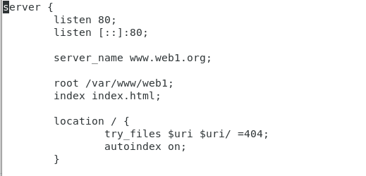
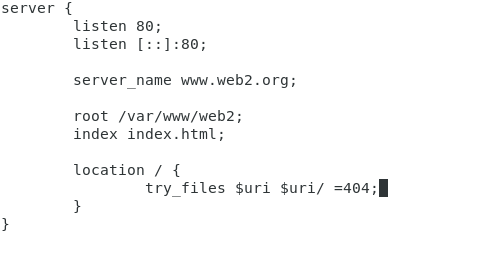
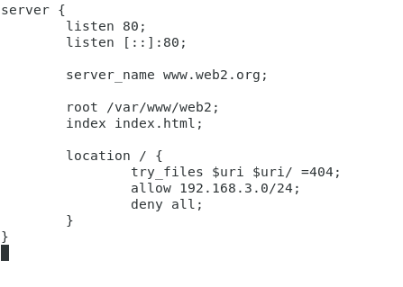

## Instalación

Página por defecto:
Para este caso práctico lo único que tendremos que hacer es editar el index.html de inicio de nginx.
cd /var/www/html/index.html

Virtual Hosting:
Vamos a crear 2 sitios web, llamados web1 y web2 usando el mismo puerto para eso tendremos que tocar un fichero.

El fichero lo llamaremos web1.conf y web2.conf.

Autenticación,Autorización y control de acceso

web1 se podra acceder desde la red externa e interna mientras que la web2 solo interna

 
